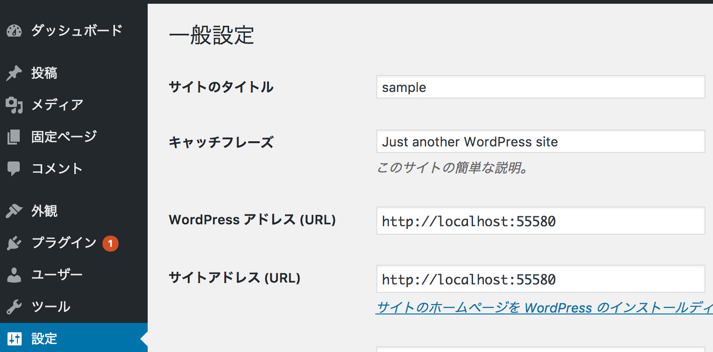

# DockerによるWordpress構築について

データを保存するデータ専用コンテナを作成する。Dockerfileに記述されているので、buildを行う。

```
docker build -t dataonly .
```

データ専用コンテナの起動

```
docker run -it --name dataonly dataonly
```

コンテナ群のバックグラウンド起動

```
docker-compose up -d
```


以下のURLで管理画面を表示できる

[http://localhost:55580/wp-admin](http://localhost:55580/wp-admin)


管理画面が立ち上がった時にwordpressアドレスとサイトアドレスが[http://localhost:55580/wp-admin](http://localhost:55580/wp-admin)になっていない場合、以下の用に修正する




コンテナ群の停止

```
docker-compose stop
```

コンテナ群の削除

```
docker-compose rm
```